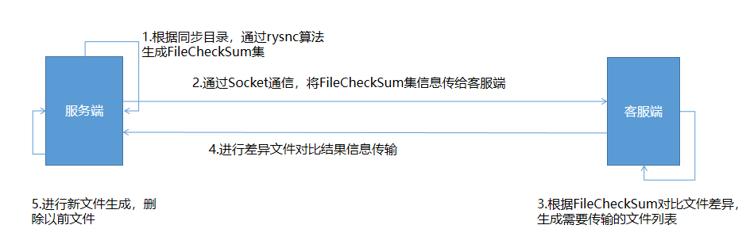

# 基于rsync的文件同步工具

思路：  

###参数说明
-m 以客户端还是服务端模式启动 server:服务端 client:客服端  

-p -port 运行端口  

-filePort 文件传输监听端口  

-h 客服端需要连接的服务端地址  

-clientPath 客服端同步目录地址  

-serverPath 服务端同步目录地址  

-clean 清空生成缓存文件  

###使用示例
服务端：

	java -jar filesync-0.0.1-SNAPSHOT.jar -m server -port 8989 -fileport 8990

客服端：

	java -jar filesync-0.0.1-SNAPSHOT.jar -m client -h 172.18.194.117 -clientPath "D:\\server\\apache-tomcat-8.0.36-2\\webapps\\SMS" -serverPath "/home/nsms/test_file_sync/SMS/"
